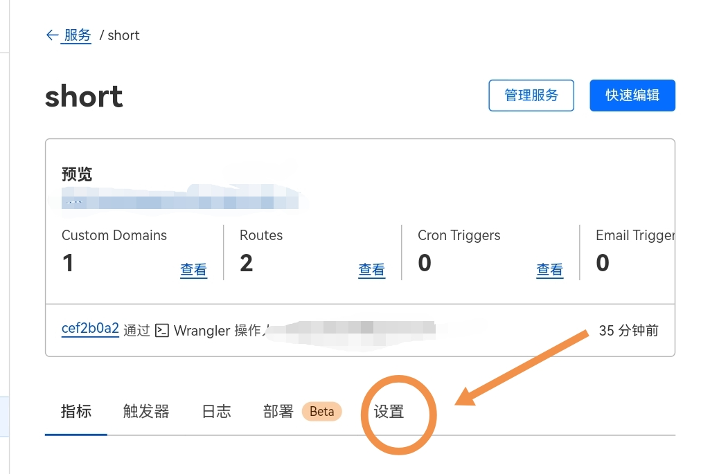
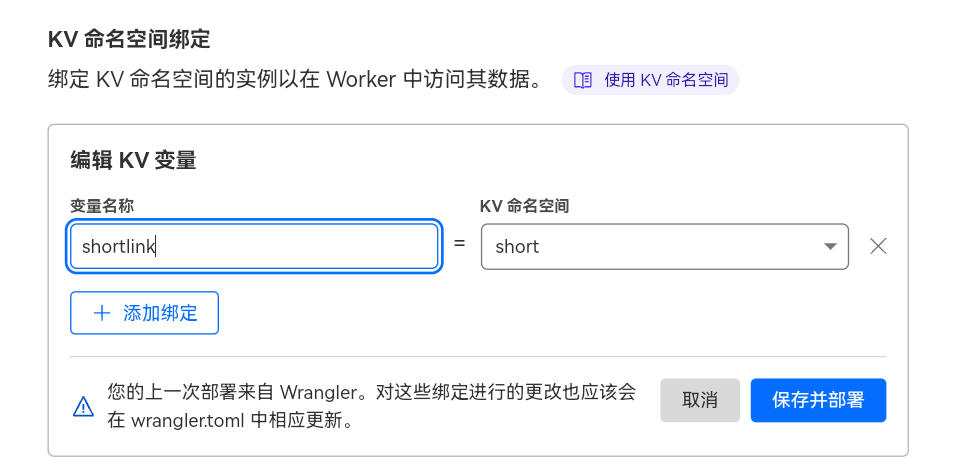

# 👷 cloudflare worker实现的短网址和文本分享


# 使用方法一 (cli操作)
首先Clone项目
``` 
git clone https://github.com/code-scan/cfwork_shortlink_text.git
```
Windows安装node.js [node.js官网](https://nodejs.org/en)
Linux or Mac自行百度解决
```
npm install -g wrangler

wrangler login

```
显示链接后按提示操作，登录成功后进入目录修改内容
```
cd cfwork_shortlink_text
```

## 修改index.js内容
修改index.js中的路径为你自己的路径,防止其他人使用,如果需要公开访问,把`admin_path`设置成`/`即可

```js
const admin_path = '/short_link_admin'
const api_path = '/short_api'
```
## 修改wrangler.toml

去cf worker页面创建一个kv，获取id
并且把id填写到`wrangler.toml`的`id`里面,在进行发布,并把`wrangler.toml`中的`account_id`改成你自己的(通过`wrangler whoami`查看)

```
wrangler publish index.js
```

# 使用方法二 (网页操作)
打开cloudflare workers，新建一个workers，名称随意，例如：shortlink
在workers处点击快速编辑，将原来的内容删除，将仓库里的`index.js`复制并粘贴到代码处，点击保存并部署
新建一个KV，名称随意，例如：shortlink
进入新建的workers，点击设置

点击变量，找到KV，点击`添加绑定`
变量名称填写`shortlink`。KV选择刚才创建的KV

点击保存即可使用默认域名进行访问
# 自定义域
请自行百度


